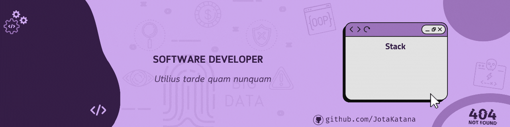

 

  
   
  

#

<picture align="center">
  <source media="(prefers-color-scheme: dark)" srcset="https://raw.githubusercontent.com/JotaKatana/JotaKatana/output/github-contribution-grid-snake-dark.svg">
  <source media="(prefers-color-scheme: light)" srcset="https://raw.githubusercontent.com/JotaKatana/JotaKatana/output/github-contribution-grid-snake-dark.svg">
  
</picture>

 
### 🤖 Main skills:

### Tools:

 
### Other Knowledge:

  
### Studying in this moment:

 
<b>Visitors Count</b>
  

 
 

